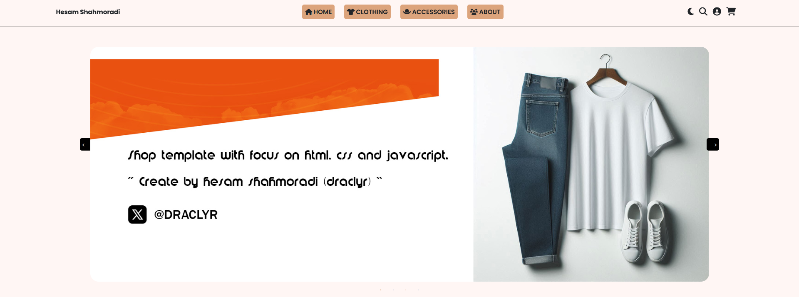
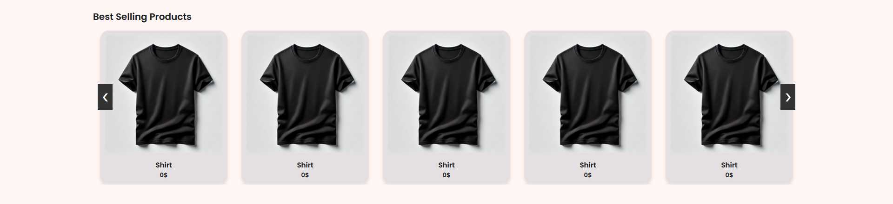
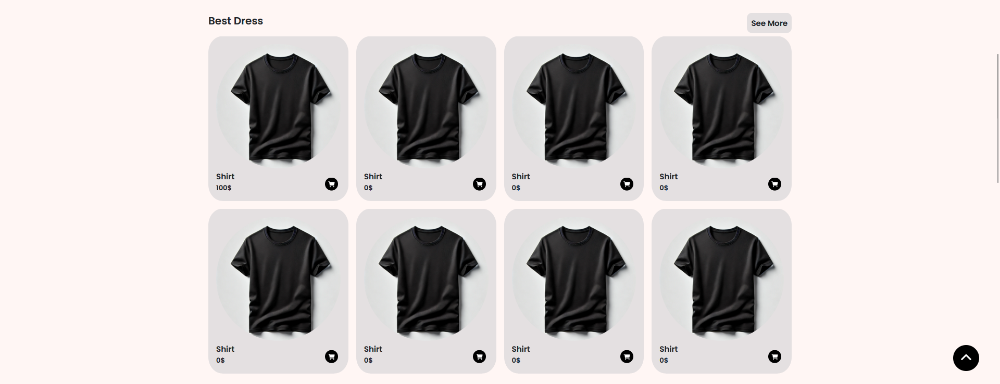
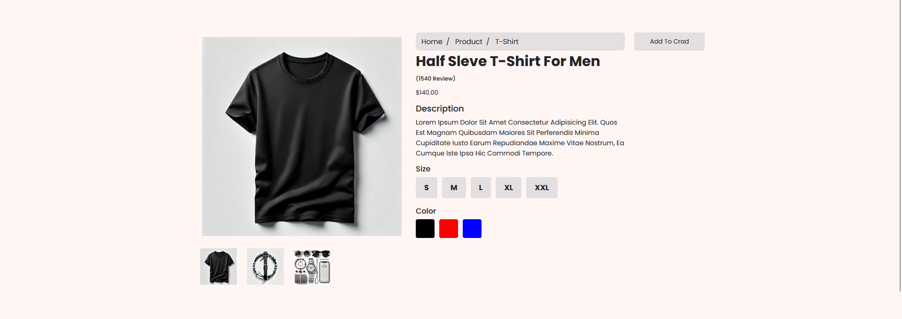

# Liboshop

<h3 text-align="center">
🏪An e-commerce website offering free features, built with a strong foundation in HTML, CSS, and JavaScript.
</h3>

This project applies JavaScript in a structured and professional manner, allowing developers to efficiently utilize its code✅

<h4 text-align="center">
A professional slider card section designed to showcase best-selling products effectively♨️
</h4>

This section allows you to feature a selection of products chosen by visitors or curated by yourself, serving as a promotional showcase for those items.

<h4 text-align="center">
Seamless product display and effortless purchasing with interactive JavaScript-powered icons💳
</h4>

This section showcases all products within the category, providing a valuable browsing experience for your website visitors. Clicking the purchase icon instantly adds the selected product to the cart😁

<h4 text-align="center">
This section allows you to showcase advertising banners from various brands, enhancing visibility and engagement!
</h4>

Enhance product categorization and improve visual presentation by incorporating a banner in this section🖥️

A crucial section for viewing product colors and details, built with optimized code for seamless functionality!

Finally, I would be delighted if you could rate the project❤️

